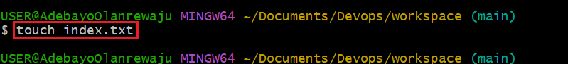
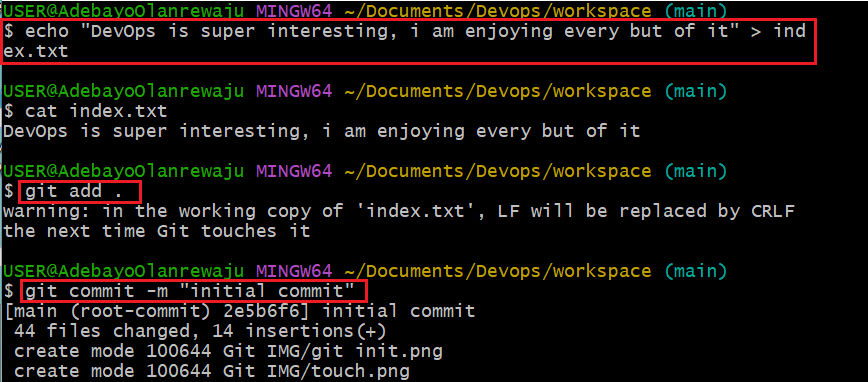

# What is Git

Git is a distributed version control system that solves the problem of sharing source code efficiently and keeping track of changes made to source code.

Git allows developers make their own copy of the central repository. That is why it is referred to as a Distributed Version Control System.

## Initializing a Git Repository

Before initializing a git repo I installed git on my computer and passed the following commands.

`git init` in my Devops workspace as shown below 

## Making your my first Commit

To commit means to save the changes made to my file. which could include adding, modifying or delete files or text. To make my commit on the Git account I created a file using the `touch command` as shown below 

I used the echo command to write in to the file created using the `echo` command 

I then proceeded to add the file (changes) into a staging area using the `git add .` command 

I then proceed to commit the file (changes) to my git hub account using the `git commit -m "initial commit"` command. not `-m "initial commit"` is used to attach a message to the commit as shown below
 

## Working with Branches

Git branch Helps me to create a different copy(page) of my source code. the default git is usually on the `main branch`.  However, I can proceed to make changes to my my new branch and the changes are independent of what is available in my main branch.

Git branch is also an important tool for collaboration within remote teams. The team members can make separate branches while working on same feature, and at the end of the day converge their changes into the main branch.

### Making a Git Branch
To make a new branch I can run `git branch [new_branch_name]` and use the `git switch [new_branch_name]` to switch to the new branch. I can also run the command `git checkout -b` the -b flag helps me to create and change into a new branch as shown below 

### Listing Git Branches

To get the list of branches on mt git account i use the `git branch` command as shown below 

### Changing into an Old Branch

To change into an existing old branch i use the command below `git checkout [branch_name]` as shown below 

### Merging a Branch into Another Branch

For the branches created, if all the various changes have been made by the users in the branches, we need to merge the changes into the main branch before the application is deployed. this can be done using the `git merge [main_branch_name]` as shown below 

### Deleting a Git Branch

After merging the other branches with the main branch, I delete the other branches using the command `git branch -d [branch_name]` as shown below

## Collaboration and Remote Repositories

A Git hub is a web based platform where git repositories are hosted. By hosting my local git repository on github, it becomes available in the public internet (it is possible to create a private repository as well) where anyone can access it. having previously created my github account I created my repository for the document in my local repository to be saved in the web as shown below 

### Pushing Local Git Repository to my Github Repository

To send a copy of of my local repository to my repository in git hub i use the command `git remote and origin [link to my github repo]` this serves as a `commit` command.

I then proceed to push the content to the remote repository using the command `git push -u origin [branch_name]` as shown below   

### Cloning Remote Git Repository

Having added a remote git repo and pushed my story from my local repo. To make a copy of my remote repo for onward modification by another user by cloning the repo using the `git clone [URL of the my remote repo]` as shown below 

